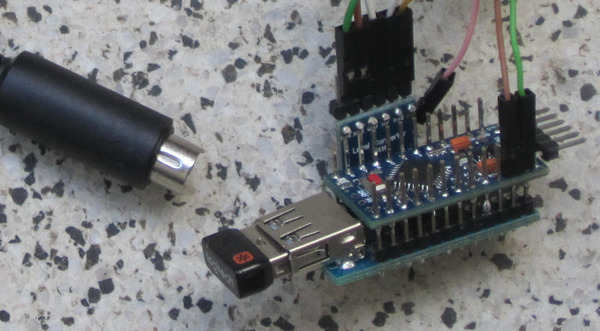

USB2Amiga
=========

This project is about connecting USB HID devices like keyboard, mouse and the
combination of those (sometimes called "desktops") to almost any Amiga. The
project originally started out to get a working keyboard for a Commodore CDTV
without spending big bugs. Also if it should work with a kvm switch that would
be nice.

The project mainly consist of an Arduino Pro Mini clone running at 3.3V / 8MHz
(5V / 16MHz won't work) together with an USB host shield mini (also a clone).
This takes care of reading the USB input. For sending the output, 3.3V are
not enough for a 5V Amiga interface, so a level shifter is needed. (Since the
Amiga is open collector, the project should work without it, it was tested and
working for a couple of hours without any problems. But the ATmega is used way
out of the specification, so a level shifter is highly recommended.)

The code is setup in a modular way, so recompiling with different options set
in `config.h`. So switching from CDTV specific behavior to a generic Amiga
approach is intended (but not yet implemented.)

System | Keyboard   | Mouse    | Joystick | Note
-------|------------|----------|----------|--------------------------------
CDTV   | working    | working  | untested | primay development target
CD32   | untested   | planning | planning | soon to come
A500   | untested   | planning | planning | keyboard will require soldering
A600   | won't work | planning | planning | different keyboard handling
A1000  | untested   | planning | planning | no system available for testing
A1200  | won't work | planning | planning | different keyboard handling
A2000  | untested   | planning | planning | soon to come
A3000  | untested   | planning | planning | no system available for testing
A4000  | untested   | planning | planning | no system available for testing
A4000T | untested   | planning | planning | no system available for testing

FAQ
---
Can I use it with an USB hub?

No, sorry. The Arduino libraries, that this project builds upon, don't support
this. So can't I. A workaround would be to build two USB2Amiga, using one for
keyboard and one for mouse.

Acknowledgements
----------------
This project wouldn't have been possible without using and twisting (or at
least looking at) other peoples code.

- USBHIDBootKbdAndMouse example of the
  [USB Host Shield Library 2.0](https://github.com/felis/USB_Host_Shield_2.0)
- [mwd2cdtv](https://github.com/matsstaff/mwd2cdtv) by matsstaff (he used
  [amiga_keyb](https://github.com/hkzlab/AVR-Experiments/tree/master/libs/amiga_keyb)
  code written by hkzlab)
- cssvb94 gave me the idea on how to include support for a standard amiga
  mouse with his project
  [AmigaUSBMouseJoystick](https://github.com/cssvb94/AmigaUSBMouseJoystick)