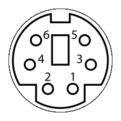

Build Configuration For Amiga CD32
==================================

**(Note: the mentioned PS/2 version is not implemented yet, as I'm still
looking for an example how to send PS/2 keyboard events. There this a lot of
code around for reading the keyboard, but not the other way.)**

These build instructions are always the same as those for
[Amiga 4000](Build_DB9.md), except that the CD32 also has a serial interface
included in the remaing two pins.

You can use the precompiled file `hex/USB2Amiga.DB9.hex` or
`hex/USB2Amiga.PS2.hex` to program the Arduino pro mini 328p 3.3V.
Which one to use depends on your configuration of the CD32. If you're using
a version without a riser card that includes a PS/2 to Amiga keyboard
adapter, you use the `USB2Amiga.DB9.hex` version. But, my system for example
has the "CD32 Expansion Adapter" designed by Kipper2k. Running two keyboard
controllers on the same interface breaks things. So, in this configuration
you can use the `USB2Amiga.PS2.hex` version of this software and instead of
connecting it to the CD32 keyboard connector you connect to the PS/2
converter.

Pins On Arduino
---------------

Pin | Signal    | Note
----|-----------|-----------------------------------------------
 2  | KBCLK     |
 3  | KBDAT     | may not be changed
 4  | DB9 Pin 1 | Y2 mouse signal
 5  | DB9 Pin 2 | X1 mouse signal
 6  | DB9 Pin 3 | Y1 mouse signal
 7  | DB9 Pin 4 | X2 mouse signal
 8  | DB9 Pin 6 | left mouse button
A0  | DB9 Pin 9 | right mouse button
A1  | DB9 Pin 5 | optional middle mouse button
GND | DB9 Pin 8 | mouse ground

[(Is the mentioned level shifter necessary?)](LevelShifter.md)

Pull these signals through a level shifter with LV# on the Arduino side and
HV# on the Amiga side. With an 8-bit level shifter you can get everything
working, if you skip the optional middle mouse button.

Connect all GNDs together: the GND of the keyboard connector, pin 8 of the
DB9 mouse connector, the Arduino pro mini and both sides of the level shifter.
There are level shifter that only have one GND and an extra connector called
"OE". According to
[this discussion](https://forum.arduino.cc/index.php?topic=406261.0)
this needs to be connected to +5V using a 1k Ohm pull-up resistor. +5V needs
to be connected to HV of the level shifter, RAW of the Arduino pro mini and
the +5V pin of the keyboard connector. The +5V of the DB9 mouse connector
can be skipped, since we are getting power from the keyboard connector
already.

The DB9 pins are described above, the pins of the keyboard connector differ
from model to model.

The connector physically the same as the PS/2 keyboard connector. This means
you can reuse and old PS/2 keyboard or mouse cable.

Pin | Function
----|----------
 1  | KBDAT
 2  | TXD (*)
 3  | GND
 4  | +5V
 5  | KBCLK
 6  | RXD (*)

Also note that all connectors show the Amiga connector side, not the cable
connector.

(*) TXD and RXD are the serial interface of the CD32. But contrary to all
    other Amigas, the power levels are TTL (+5V and 0V) instead of RS232
    (+12V and -12V). This way it can be easily connected to a cheap
    USB-to-TTL serial converter to connect to modern PCs.
